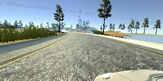
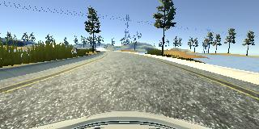
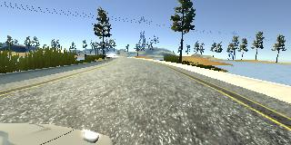
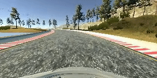

# Behavioral Cloning project

## Goal of the project

Goal of this project is to train neural network that is capable to predict steering wheel angle based on camera image. 

## Data generation
For the data generating I used simulator that provides virtual track with controllable car in it. 
I recorded my driving across the track for one full lap. For record was used 3 virtual cameras that was installed in front of a car.
As a result, for each timestamp I've got three images with resolution 320x160. Also for each timestamp I recorded a steering wheel angle.

   

## Data processing
To get more data and make my network more sustainable I used some of data augmentation techniques:
1. Fliping an image horizontally. It helps network learn more efficient and give us data with turning in oposit side.
2. Using left and right images with corrected steering wheel angle. It helps network to know how to return to the center of a road.
3. Croping the upper part of image. This part of image doesn't contain any useful information about the road and will only distract the model.

## Network architecture

For this project I used nVidea's NN that was designed for End-to-end learning of self-driving cars. 
This network consists of 5 convolution and 5 fully-conected layers.

## Generators

Considering the fact that training data takes a lot of disk space it is quite hard to load all the data in RAM in the begining of training process.
For this reasone I created generator that responsible for loading data from disk on fly for each batch.

## Training process

In order to train this network I used MSE as a loss function and Adam optimizer as an optimizer. 
I set batch size to 128 and the number of epoch  to 10. 
All the data was normalized to be in interval (0..1) and recentred to have mean in 0.

## Conclusion

As a result this model was capable to drive whole lap without any issues. Full video can be download [here](./video.mp4)
